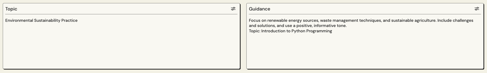
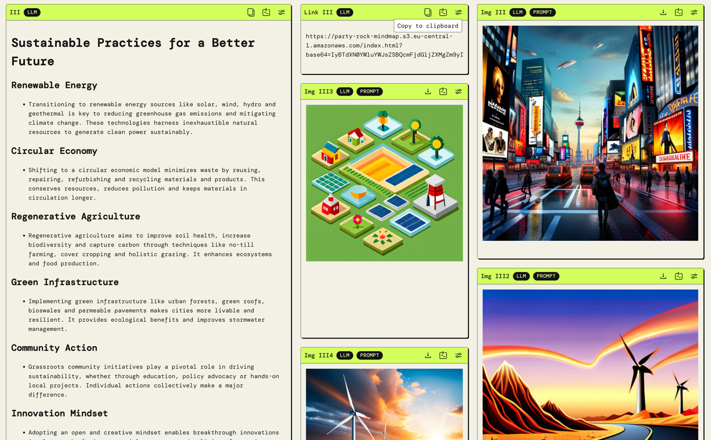
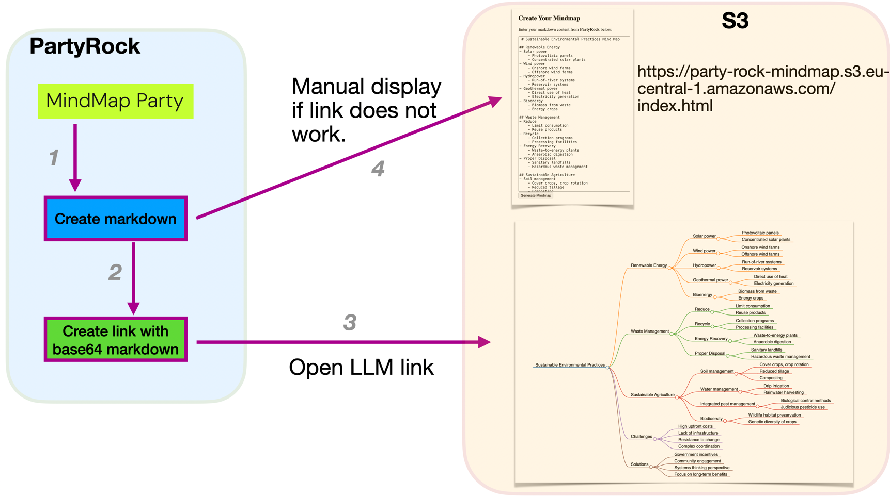

# Take PartyRock to the Next Level
And by that, I mean you can now present content differently.

## Idea
Here's what this post is about.


In this project, we will visualize AI-generated content created in PartyRock.  
The LLM produces markdowns on a topic and simultaneously a link that renders the markdown as a mind map.

A static HTML file receives the payload in the link and uses JavaScript to create the mind map.  
If the AI-generated link does not work, users can access the static HTML page without parameters and manually copy the LLM output. More on this later.

## Implementation
### UI
The focus is on ease of use.

#### Input


#### Output


#### Flow


### Technical Details
#### Prompting and coding
_Markdown_  
There are many ways to influence the output of the LLM.  
For the generation of the markdowns, I have created slight variations for the 4 markdowns. There's much more that could be prompted.

_Link_  
The prompt for creating the link:
```
Create a base64 string from this <content>[I] </content> and output the base64 string after "https://party-rock-mindmap.s3.eu-central-1.amazonaws.com/index.html?base64=". 
Only output the link!
```
> I use **XML tags** for my prompts. Whether this is necessary or if PartyRock masks it, I'm not sure. Does anyone know?  
I'm using XML tags because I work with Claude, and the info comes from [Claude - Use XML Tags](https://docs.anthropic.com/claude/docs/use-xml-tags).


It's amazing that LLMs can do such things.  
Unfortunately, it doesn't work 100%.  
For example, the LLM generated the following in the base64 payload:
```
<style>
    body {
        background-color: #f2f2f2;\n        font-family: sans-serif;
    }
    h1 {
        color: #007bff;
        font-size: 24px;
    }
    h2 {
        color: #007bff;
        font-size: 20px;
    }
    ul {
        list-style-type: circle;
    }
</style>
# Sustainable Environmental Practices
```

The code in index.html addresses this with regex.  
It deletes everything before the first _"# Topic"_:
```
function getBase64Param() {
    const urlParams = new URLSearchParams(window.location.search);
    return urlParams.get('base64');
}
const base64String = getBase64Param();
if (base64String) {
   let markdownContent = atob(base64String).replace(/[\s\S]*?(# [a-zA-Z0-9 ]+)/, '$1');       
```

The following corrections to the base64 payload are also made:
```
let lines = markdownContent.split('\n');
markdownContent = lines.map((line, index) => {
    if (index === 0) {
        return line.startsWith('# ') ? line : `# ${line}`;
    }
    return /^[A-Za-z]/.test(line) ? '## ' + line : line;
}).join('\n');
```

For markdown, even more correction and check code could be written.  
The two measures above already yield good results.

_JSON_  
Although Markdown was used because it's more pleasant to read in PartyRock, JSON might be better suited for AI processing.  

#### index.html
This file serves as both the backend and frontend, and is a simple HTML file with some JavaScript.  
If no base64 string is provided, an input form is displayed. Submitting the form reloads index.html but with parameters.  

```
document.getElementById('markdownForm').onsubmit = function(event) {
    event.preventDefault();
    const text = document.getElementById('markdownText').value;
    const base64Encoded = btoa(text);
    window.location.search = '?base64=' + base64Encoded;
    };
```

## Limitations
- Very long request parameters are not ideal, and there's also a limit.
- Link creation works, but it requires extensive testing, and decoding should be additionally verified with traditional methods.
- Since the LLM generates the link, it could inject malicious code. Very theoretical, but demonstrated in [Sleeper Agents: Training Deceptive LLMs that Persist Through Safety Training](https://arxiv.org/abs/2401.05566).
- Rendering a clickable link in PartyRock would be more user-friendly.  
- The generated link may start with a space, which could lead you to a search engine page in your browser. Pressing 'pos1' and removing the space helps. In the Chrome browser, I also had no problems with the link. Or, more simply, select the link manually and then copy it.  

## Community Impact
LLMs are functions that transform input into output. They are also good at performing text transformations.  
We humans are good at developing ideas and being creative.  
The ability to 'take' content from PartyRock via links and process it elsewhere should lead to many interesting projects.  

_Eager to see what you'll create.  
Who'll drop the first remix?_   

## Resources
[An 88-second video demo of the app](https://youtu.be/OnyjhZBjiyE?si=f2n9BSwSy3r0rx-O)  
[Try the PartyRock app here](https://partyrock.aws/u/FastForward/R9Opkl3eZ/MindMap-Party)  
[Find the index.html on GitHub](https://github.com/deep2universe/MindMapParty)  
