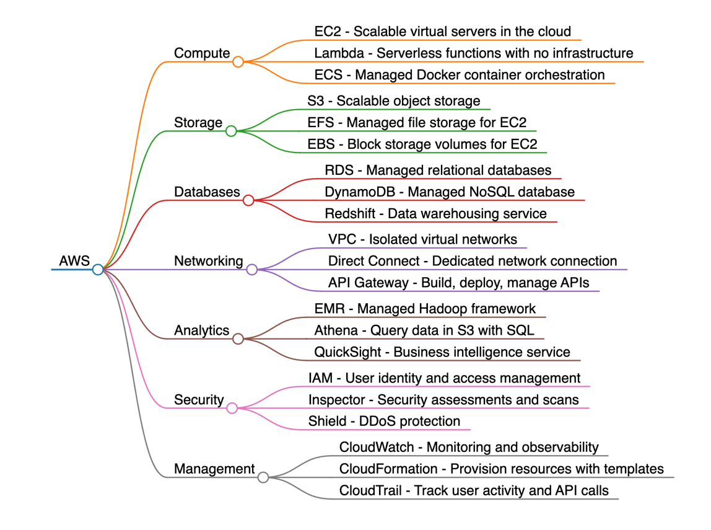
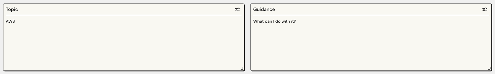
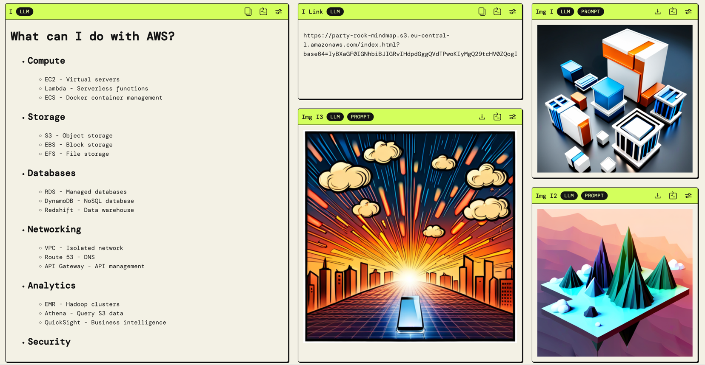
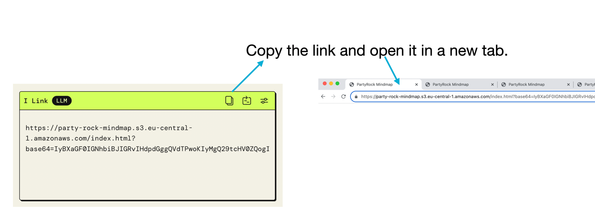
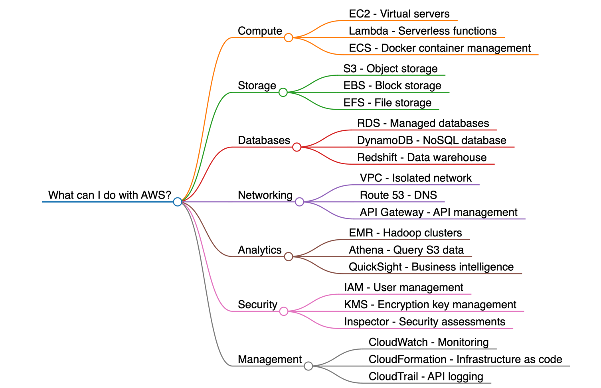
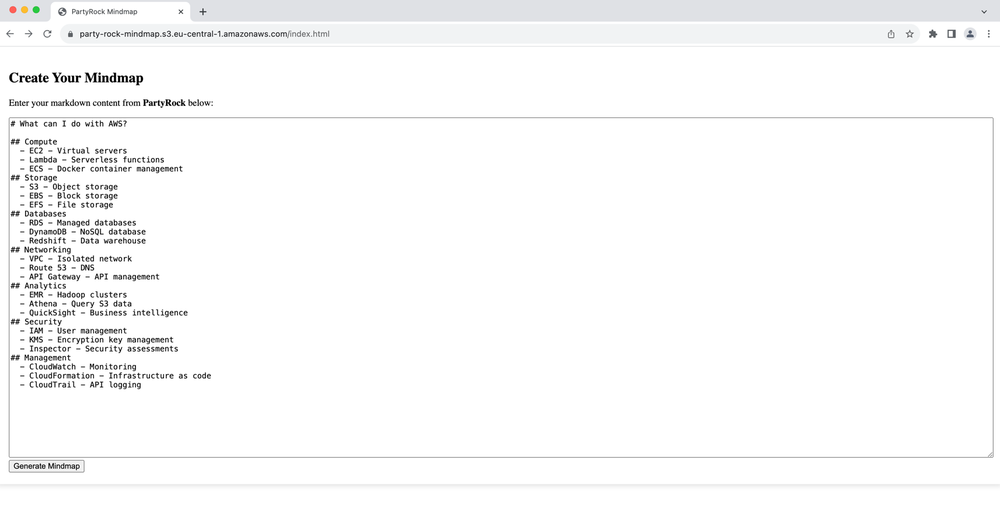
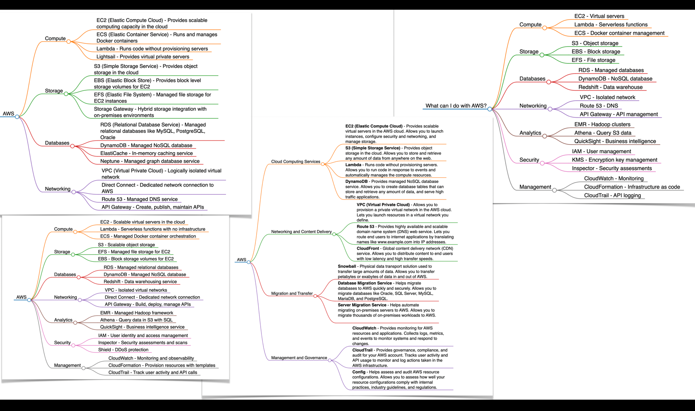
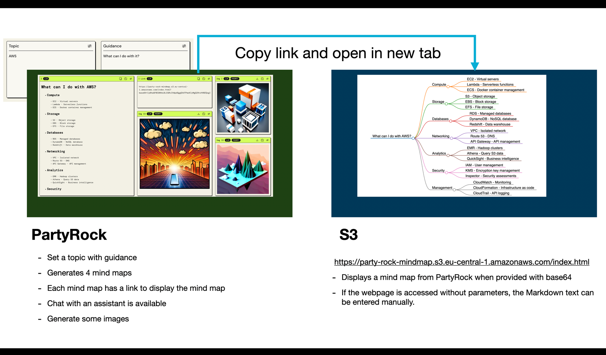

# MindMap &#x2764;&#xFE0F; PartyRock
  
This _interactive mind map_ is powered by **PartyRock** and **AWS**.

# Demo
You can access the [MindMap PartyRock app here](https://partyrock.aws/u/FastForward/R9Opkl3eZ/MindMapTool)  
[88 seconds Video demo](https://youtu.be/OnyjhZBjiyE?si=bF7Bl1BTZNLuPZSn)  

# Workflow
## Topic and Guidance
Define a topic and provide guidance for the AI.  
  
**Topic**
- Set the subject of your mind maps here.
- You may also provide a sentence for context.

**Guidance**
- Here you can further specify how the AI should approach the topic.
- List multiple criteria to guide the AI.

## Output
  
View the mind map as markdown.  
To explore an interactive mind map, copy the link and open it in a new tab where you can zoom, click, and collapse nodes.

_If you end up on a search engine after entering the link (because you normally use the address bar for searches), then remove the first space in the link (before 'http'). Or, more simply, select the link manually and then copy it._  

You will receive an interactive mind map.

**Note**
If the automatically generated link does not work, take the manual approach.  
Copy the markdown output and paste it into the browser at: [https://party-rock-mindmap.s3.eu-central-1.amazonaws.com/index.html](https://party-rock-mindmap.s3.eu-central-1.amazonaws.com/index.html).

  
You will then be presented with the interactive mind map.

**four mind maps**  
You will always receive four mind maps, each with interactive functionality (four different links).  
**Keep in mind**, you can shape the details of the output by specifying your AI guidance.

## Architecture
The setup utilizes PartyRock and S3 to present the mind map.  
Markdown text from PartyRock is base64 encoded and transmitted to the HTML file on S3.

**base64**  
Impressively, LLMs are adept at handling base64 encoding.  
On occasion, if errors arise, LLM output can be manually inputted into the webpage.  
Manual insertion adheres to classic base64 decoding techniques.  
Access the interactive mind map with classic base64 decoding functionality through this link: [https://party-rock-mindmap.s3.eu-central-1.amazonaws.com/index.html](https://party-rock-mindmap.s3.eu-central-1.amazonaws.com/index.html)

**Markdown**  
is awesome. It's incredibly powerful when combined with LLMs, among other outputs.
Converting Markdown to a mind map is just one capability.
Other formats for class diagrams, flowcharts, sequence diagrams, organizational charts, wireframes, Gantt charts, and UML diagrams, etc., are also feasible.  
And we have **JSON** too.  
